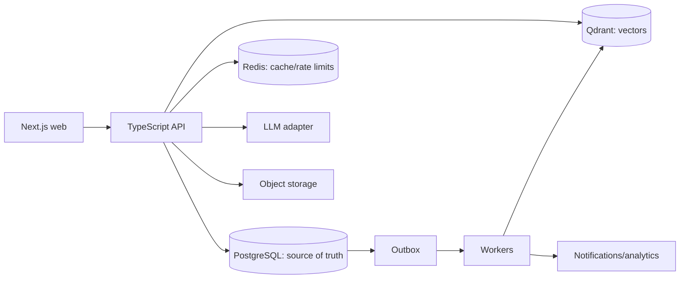

# 02 — System architecture specification

**Status:** Approved reference architecture; implementation choices noted as assumptions  
**Last updated:** 2026-09-20  
**Companions:** [overview](00_project_overview.md) · [build plan](03_build_plan.md) · [ADRs](04_design_decisions_log.md)  
**Source of truth for:** Technical boundaries, data ownership, reliability, security, and operations.

## Confirmed constraints going in
Modular monolith with async workers, pnpm workspaces, TypeScript strict mode, Drizzle ORM, and committed SQL migrations; Next.js TypeScript web on Vercel; separate Hono TypeScript API on Vercel; Better Auth authentication foundation with credentials, Google OAuth, and database-backed opaque sessions; Neon PostgreSQL authoritative state; Upstash Redis ephemeral/cache; Qdrant Cloud non-authoritative semantic retrieval; provider adapter with OpenRouter as the initial LLM access layer; Nodemailer email adapter with Gmail SMTP for local/prototype verification/reset email only; simulated payments/shipping; database outbox. Baseline paths must remain usable when AI fails.

## High-level architecture

## Component responsibilities
Identity owns sessions/profiles/addresses; catalog owns canonical products/variants/media; offers/inventory owns seller offers and reservations; search owns lexical retrieval/filter/ranking; decision intelligence owns validated AI outputs; cart/promotions owns cart totals; checkout/orders owns payment simulation and order transitions; fulfillment owns delivery/tracking simulation; returns/reviews/support own policy-gated lifecycle actions. Modules communicate by interfaces/events, not arbitrary cross-table writes.

## Interfaces and data flow
Search unions lexical PostgreSQL candidates and Qdrant candidates, re-fetches authoritative offers/stock/prices, enforces hard constraints, and applies a versioned deterministic ranker. Checkout validates server-side totals, transactionally reserves inventory, creates order/status history/outbox together, then workers simulate fulfillment and notifications. AI receives only allowed facts/query taxonomy and returns schema-validated data; deterministic fallback remains available.

## Data model and ownership
Products have variants, attributes, media, reviews, questions, and offers. Offers have seller, price, condition, stock, and delivery terms. Cart items are offer-plus-variant keyed. Orders contain immutable item/price/address snapshots, payment attempts, shipments, and history. Returns are item-level state machines. Money uses minor units/decimal—not floats. PostgreSQL is authoritative; Redis/Qdrant are never final commerce records. Drizzle models express typed database access, and schema changes are committed SQL migrations.

## External integrations
| System | Input/output | Auth | Failure / retry | Authority |
|---|---|---|---|---|
| LLM adapter | Query/fact sheet → constrained JSON/wording through OpenRouter | provider secret [Assumption D-11] | validate; fall back; cache only validated parses; request timeout required | None |
| Qdrant Cloud | product/review embedding ↔ candidate IDs | service credentials [Assumption] | worker retry; lexical fallback; index is rebuildable | PostgreSQL |
| Object storage | signed media upload/read | signed URLs [Assumption] | retry/idempotent upload design | media bytes only |
| Payment/shipping adapters | simulated authorize/fulfillment | mock contract | deterministic simulation with documented success, failure, timeout, idempotency, shipment-progress, cancellation, and refund states | PostgreSQL order state |

## Security and trust boundaries
Better Auth is the selected authentication foundation with credentials, Google OAuth, and database-backed opaque sessions. Session expiry is 7 days with 1-day rolling refresh. Cookies are HTTP-only, secure, SameSite=Lax. Verification and password-reset tokens are single-use and expire after 15 minutes. Nodemailer sends verification/password-reset emails through an adapter; Gmail SMTP is local/prototype only, and production email provider/domain/deliverability are deployment gates. Enforce CSRF, origin checks, CORS, and CSP centrally. Authenticate and authorize every owned resource; validate/size-limit input; rate-limit auth, suggestions, support, reviews, and AI. Escape model output, protect secrets, minimize/retain behavior data deliberately, and audit state-changing support/order/return/refund actions. Never store cards/CVV/bank credentials.

## Failure behavior
Use idempotency keys for retriable commands. Keep inventory transaction short with version check or row lock; release reservations on failure/expiry/cancellation. Append status history and outbox record in the same transaction. Workers use bounded exponential retries and dead-letter visibility. Display recoverable stock/policy errors; AI outage degrades to conventional search and self-service.

## Background work
Outbox consumers index catalog/reviews, invalidate caches, simulate fulfillment, produce notifications, and record analytics. Consumers must be idempotent. On Vercel, these duties run through scheduled functions or an explicitly approved managed background-job mechanism; do not assume a continuously running server process.

## Observability
Structured redacted logs; request/trace IDs across web/API/outbox/workers; latency/error/cache/queue/reservation/no-result/AI-fallback/state-failure metrics; redacted mutation audit records.

## Deployment and operations
Deploy the Next.js web app and Hono API on Vercel with separate web/API surfaces; keep worker/outbox duties on Vercel native scheduled/background services where suitable. Neon PostgreSQL, Upstash Redis, Qdrant Cloud, storage/CDN, and secrets manager are the target shape. Configuration is environment-driven; production startup validates required environment variables rather than allowing missing credentials or unsafe defaults. Environments, committed SQL migrations, health/readiness checks, backups, and rollback are required. **[Assumption] D-02:** Vercel, Neon, Upstash, and Qdrant Cloud are selected. Final regions, function runtime limits, scheduled/background execution details, SLO ownership, and incident runbooks are pre-staging/production deployment gates, not U0/local implementation blockers.

## Assumptions / decisions to validate
D-02 deployment operations gates; D-03 Hono/Drizzle/Better Auth/Nodemailer implementation details; D-04 commerce policy; D-05–D-10 pre-build security/operational controls; and D-11 OpenRouter operational enablement. See [build plan](03_build_plan.md#master-decision-coverage-table).

## Ownership and write rules
| Module | Owns writes to | May read through |
|---|---|---|
| Identity | users, sessions, addresses, preferences | identity interfaces |
| Catalog | products, variants, attributes, media, categories | catalog queries |
| Offers & inventory | offers, warehouses, stock, reservations | availability and offer queries |
| Cart & promotions | carts, cart items, applied promotion records | pricing/eligibility interfaces |
| Checkout & orders | quotes, orders, order items, payment attempts, order history | order queries |
| Fulfillment | shipments, shipment history, delivery simulation records | fulfillment interfaces |
| Returns & refunds | return requests, return history, refund records | return queries |
| Reviews & Q&A | reviews, votes, questions, moderation records | catalog/review queries |
| Search & intelligence | search/index metadata and non-authoritative retrieval data | published catalog and review interfaces |
| Platform | outbox, audit, idempotency records | explicit platform interfaces |

No module writes another module's tables to complete a shortcut. A cross-module command is orchestrated through a domain interface within the required transaction boundary; later work is represented by an outbox event. Historical order snapshots retain committed commerce facts when live catalog records change.

## Command and checkout contract
All external commands carry a request correlation ID. Commands that create or advance commerce state also carry a caller-scoped idempotency key. The server stores the key, request fingerprint, resulting resource reference, and terminal response enough to replay completed commands safely. Reusing a key with a materially different request is a conflict, not a second command.

| Outcome class | Meaning | Shopper behavior |
|---|---|---|
| Validation | Input cannot be accepted before policy check. | Correct highlighted fields and resubmit. |
| Authorization/not found | Resource is not available to this actor. | Do not disclose ownership or resource details. |
| Policy conflict | Valid request is disallowed by stock, state, expiry, or eligibility. | Show reason and recovery action. |
| Idempotent replay | Original command completed. | Return original terminal result. |
| Retryable dependency | Dependency did not complete. | Permit safe retry with the same key. |
| Internal failure | No known terminal result. | Do not claim success; correlate and investigate. |

Checkout must: (1) quote from authoritative cart, offers, address, and policy inputs; (2) confirm only an unexpired quote for the authenticated shopper; (3) in one short PostgreSQL transaction revalidate policy, reserve stock, create immutable order/history, persist simulated payment result, and append outbox records; (4) commit none of those order-confirming effects on failure; and (5) start fulfillment, indexing, notification, and analytics only from committed events. Reservation duration, locking, tax, promotion, and delivery formulas remain D-04 policy work.

## Outbox delivery contract
Each event has stable event ID, type, aggregate type/ID, schema version, occurrence timestamp, correlation ID, payload, attempt count, and processing state. Consumers deduplicate before observable effects. Payloads contain snapshots sufficient for consumer purpose and no card data or unnecessary PII.

Workers use bounded exponential retries. Terminal failure remains visible with event ID, consumer, error category, and safe replay procedure; it is never silently discarded. Retry cadence, maximum attempts, dead-letter storage, and operator ownership are U0/D-02 operational decisions.

| Event | Produced when | Required consumer outcome |
|---|---|---|
| `catalog.product_published` | product becomes shopper-visible | index/update discovery cache |
| `offer.changed` | price, availability, or delivery inputs change | invalidate discovery representations |
| `order.confirmed` | checkout transaction commits | begin fulfillment and confirmation notification |
| `shipment.status_changed` | fulfillment transition commits | update timeline and notification eligibility |
| `order.delivered` | delivery transition commits | calculate review/return eligibility |
| `return.requested` | return request commits | create return workflow/timeline entry |
| `return.refunded` | refund transition commits | update shopper timeline and notification eligibility |
| `review.published` | moderation permits a review | refresh aggregates and retrieval |

## AI evidence and safety contract
AI capabilities receive purpose-limited evidence bundles, not general database access. Bundles declare source record IDs and versions. Output is parsed against a versioned schema, bounded for size, rendered as untrusted text, and rejected if it references facts outside its supplied bundle.

| Capability | Must expose | Fallback |
|---|---|---|
| Intent parsing | parsed constraints, confidence/uncertainty, editable interpretation | original query and conventional filters |
| Rank explanation | actual deterministic factors and product/offer IDs | template-rendered factors |
| Comparison/review summary | fact/review references and unavailable data | raw comparison table and reviews |
| Support guidance | authenticated tool results and proposed action | direct self-service links |

AI cannot issue database queries, select a final offer, change a quote, alter a policy result, or invoke a mutation directly. Prompt templates, schemas, taxonomy versions, evaluation fixtures, OpenRouter configuration, and model-routing policy become version-controlled artifacts when U5 begins.

## Security operational requirements
- Authenticate before reading account-owned resources and authorize every aggregate, including support-tool access.
- Protect browser session flows against CSRF according to D-03; configure CORS only for approved web origins.
- Rate-limit and abuse-monitor auth, recovery, review, support, suggestion, and AI endpoints.
- Media upload requires type/size validation, isolated object paths, and scanning/moderation before public presentation where enabled.
- Define data classification, retention, deletion/export behavior, and incident response before collecting production personal or behavioral data.

## Pre-build security and abuse controls
The following are release gates, not implementation suggestions. Their concrete configuration is owned by D-05 through D-10 in the [build plan](03_build_plan.md#master-decision-coverage-table).

### Identity, sessions, and browser protection
- Before account creation, select a password hashing algorithm and parameters (Argon2id is the required baseline unless a documented ADR justifies an equivalent); never log, reversibly encrypt, or reuse passwords.
- Email-verification and recovery tokens must be single-use, high-entropy, expiry-bound, stored only as hashes, invalidated after use, and rate-limited. Sign-in, registration, recovery, and verification responses must not reveal whether an account exists.
- The chosen session design uses Better Auth database-backed opaque sessions with HTTP-only secure SameSite=Lax cookies, 7-day expiry, 1-day rolling refresh, revocation on credential change, and explicit logout semantics. Verification and password-reset tokens are single-use, non-enumerating, and expire after 15 minutes.
- Cookie-authenticated mutations require central CSRF and origin checks. CORS permits only explicitly configured first-party origins; credentials are never accepted with wildcard origins. Browser security headers, including CSP appropriate to the selected UI, must be enforced centrally and tested before production.

### Rate limiting and abuse prevention
- Rate-limit and timeout policy must define route groups, identity dimensions (IP, account, session, and device signal where lawful), burst and sustained limits, responses, exemptions, monitoring, and endpoint deadlines. It covers registration, sign-in, recovery, verification, search/suggestions, review/Q&A, support, AI, cart, checkout, confirmation, and uploads. App-level AI spend caps are not required because budget is managed in OpenRouter; the app still enforces AI request timeouts and fallback.
- Redis/rate-limit-store failure mode is explicit: sensitive endpoints fail closed or use a conservative local fallback; public read paths may degrade only under a documented abuse-control posture. Limits must not be bypassable through forwarded-header spoofing, unauthenticated key rotation, or pagination/query variation.
- Add bot/credential-stuffing detection, review-spam/report handling, request/body/upload size limits, pagination limits, query-complexity limits, endpoint timeouts, and AI request timeouts/fallback. App-level AI spend caps are not required because budget is managed in OpenRouter. Coupon/promotion abuse and checkout-attempt anomalies are audited even while payments are simulated.

### Internal access, data, and media
- Define default-deny internal roles for catalog publication, review moderation, operational support, dead-letter replay, migration execution, and audit-log access. Internal actions require least privilege, attribution, and audit records; no shopper session can reach operational endpoints.
- Before production data collection, approve a data inventory/classification, lawful purpose, retention schedule, export/deletion process, backup-deletion behavior, and incident response/notification ownership. Analytics must use pseudonymous identifiers where possible and must not enter shared caches or AI evidence unless purpose-approved.
- Media is quarantined until allowlisted MIME plus magic-byte validation, size limits, malware scan, and any required moderation complete. Use isolated unguessable object paths, short-lived least-privilege signed URLs, safe download headers, and metadata/EXIF stripping where exposed.

### AI and supply-chain controls
- Treat catalog, reviews, user queries, and retrieved text as potentially adversarial prompt content. Keep instructions separate from evidence, do not grant model tool/database access, enforce schema and output-size limits, and test prompt-injection fixtures.
- Before enabling OpenRouter-backed AI, approve OpenRouter and downstream model data-retention/training terms, model allowlist/routing policy, credentials, timeout/circuit-breaker behavior, and release thresholds for valid-schema, constraint accuracy, evidence coverage, and unsupported-claim rate. Spend caps are managed in OpenRouter; the app still enforces request timeouts and safe fallback.
- U0 establishes lockfile discipline, automated dependency vulnerability and secret scanning, dependency ownership/upgrade cadence, and an SBOM/license review policy proportionate to the deployed product.

## Recovery and operational gates
- D-02 must define RPO/RTO, backup encryption/access, restore-test cadence, migration rollback/forward-fix rules, on-call and incident-severity ownership, alert thresholds, and production/staging separation before launch.
- Shared caches must use bounded TTLs, explicit invalidation owners, and keys that cannot expose account-specific or personal data across shoppers.
- The API contract defines a versioned error envelope, request/body limits, pagination ceilings, deadline propagation, and dependency timeout/circuit-breaker behavior. Audit and dead-letter replay are restricted to authorized operators and produce a new immutable audit event.
