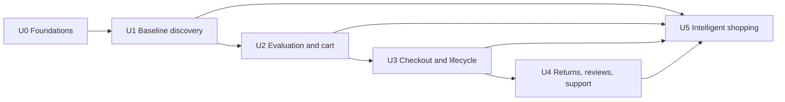

# 03 — Build plan

**Status:** Approved dependency plan  
**Last updated:** 2026-09-20  
**Companions:** [overview](00_project_overview.md) · [architecture](02_system_architecture_spec.md) · [ADRs](04_design_decisions_log.md)  
**Source of truth for:** What is built next, in dependency order, and which decisions remain unresolved.

## How to use this document
Units retire coherent risks; they are not calendar phases. Do not begin a unit with unresolved prerequisites. Update its status in [progress](../progress-tracker.md) when observed work changes.

## Dependency graph at a glance

## U0 — Foundations and contracts
**Risk retired:** unsafe/untyped boundaries, public-endpoint abuse, and unclear operational choices. **Scope:** choose D-02–D-10 with ADR updates; establish monorepo/runtime, shared contracts, identity, catalog seed model, migration/outbox foundation, observability, security, privacy, and abuse-control baselines. **Dependencies:** none. **Definition of done:** documented choices are implemented; validated API contract handles authenticated identity and product seed reads; session/CSRF/CORS, rate-limit, internal-role, upload, privacy, backup/restore, and incident controls have policy fixtures; migration/outbox and redacted request logs prove traceable writes; repository supplies real verification commands.

## U1 — Baseline discovery
**Risk retired:** shoppers cannot reliably find available products without AI. **Scope:** category/home, lexical search, URL filters/sort/suggestions, product/variant/offer detail, address-aware simulated delivery. **Dependencies:** U0. **Definition of done:** a shopper can browse/search/filter/sort, see correct authoritative offer availability and delivery simulation, and recover from empty/error/AI-unavailable states.

## U2 — Evaluation and cart
**Risk retired:** selection and cart data are not offer/variant-correct. **Scope:** comparison table, reviews/Q&A browsing, related products, persistent offer/variant cart, save-for-later, server totals. **Dependencies:** U1. **Definition of done:** shopper compares up to three factsheets, changes cart items or saves/restores an item for later, and sees correct server-calculated subtotal/discount/shipping/tax representation with no float money handling.

## U3 — Checkout and order lifecycle
**Risk retired:** duplicate/oversold/unauditable orders. **Scope:** address/payment mock selection, quote/confirm, transactional reservation, immutable order snapshots, fulfillment/tracking, policy-gated cancellation and pre-fulfillment address/delivery edit simulation. **Dependencies:** U2. **Definition of done:** authenticated shopper completes one idempotent checkout; concurrency failure is recoverable; policy-gated edits/cancellation and order timeline/audit/outbox prove lifecycle behavior.

## U4 — Returns, reviews, and support
**Risk retired:** post-purchase actions bypass eligibility or mutate without consent. **Scope:** delivered-item review eligibility, returns/refunds, help hub/order-specific self-service, and issue timeline. **Dependencies:** U3. **Definition of done:** delivered eligible item can receive a verified review or valid return; authenticated shopper can directly track, cancel, return, or inspect a refund; ineligible action explains why; support proposal requires explicit confirmation and records audit/history.

## U5 — Intelligent shopping
**Risk retired:** AI can be unsupported or degrade baseline behavior. **Scope:** intent parsing, hybrid retrieval, deterministic rank explanations, fact-grounded comparison/review intelligence, transparent personalization, support guidance. **Dependencies:** U1–U4. **Definition of done:** fixed evaluation queries show valid interpreted constraints, no unsupported claims, editable guidance, measurable fallback, and unchanged conventional flow completion.

## Master decision-coverage table

| D-ID | Decision / assumption | Source | Owning unit | Status | Resolution target |
|---|---|---|---|---|---|
| D-01 | Conventional baseline precedes AI | PRD §7.1 | U0–U5 | Confirmed | Enforce throughout |
| D-02 | Deployment provider, region, topology, SLO ownership | 00 / 02 / ADR-004 | U0 | Open | Before deployment work |
| D-03 | Fastify vs NestJS; authentication/session mechanism | 00 / 02 / ADR-004 | U0 | Open | Before API foundation |
| D-04 | Initial locale/currency, tax, promotion, cancellation, return/refund, reservation, and delivery policy | 00 / 02 / ADR-005 | U1–U4 | Open | Before corresponding shopper flow |
| D-05 | Password, identity verification/recovery, session, CSRF, CORS, and browser-security contract | 00 / 02 / ADR-008 | U0 | Open | Before identity endpoints |
| D-06 | Rate-limit, abuse, bot, fraud-signal, and AI-cost policy | 00 / 02 / ADR-008 | U0 | Open | Before public/authenticated endpoints |
| D-07 | Data classification, retention, deletion/export, provider-data, and incident-response policy | 00 / 02 / ADR-008 | U0 | Open | Before production data collection/provider enablement |
| D-08 | Internal operator roles, privileged access, and audit policy | 00 / 02 / ADR-008 | U0 | Open | Before operational capabilities |
| D-09 | Media validation, quarantine, scanning, moderation, and publication policy | 00 / 02 / ADR-008 | U0 | Open | Before media uploads |
| D-10 | Backup/restore, RPO/RTO, alerting, on-call, and dead-letter replay policy | 00 / 02 / ADR-008 | U0 | Open | Before production launch |
| D-11 | AI provider credentials, terms, region/retention posture, quotas, cost controls, fallback, and evaluation thresholds | 00 / 02 / ADR-010 | U5 | Open | Before AI provider enablement |

When a D-ID resolves, update this row, its ADR, the original `[Assumption]`, and the progress log together.

## U0 decision checklist

Before U0 implementation, close or explicitly sequence the foundation decisions below without silently selecting defaults:

- D-02: deployment provider, region, topology, environments, SLO/RPO/RTO ownership, and incident runbooks.
- D-03: API framework, auth/session mechanism, API envelope, CSRF/CORS/CSP posture, and error contracts.
- D-05: password, account recovery, session lifetime, CSRF/CORS, and browser-security contract.
- D-06: endpoint rate limits, bot/abuse controls, fraud-signal logging, AI budget/concurrency caps, and timeout limits.
- D-07: data classification, retention/deletion/export, provider-data handling, and incident-response policy.
- D-08: internal roles, privileged access, break-glass behavior, and audit requirements.
- D-09: media validation, scanning/quarantine, moderation, publication, and takedown policy.
- D-10: backup/restore, dead-letter replay, alerting, on-call, and launch operations.

D-04 and D-11 may be sequenced later only where U0 contracts avoid implying unapproved commerce policy or production AI-provider behavior.

## Work packages and exit evidence
### U0 — Foundations and contracts
**Work packages:** repository/environment contract; schema and migration discipline; authentication/session/CSRF/CORS selection; API envelope and shared schemas; rate-limit/abuse controls; operator-role boundary; data/privacy and media policy; seeded catalog read path; request correlation/redaction; outbox producer/consumer harness; backup/restore and incident runbooks; local and staging verification commands.
**Exit evidence:** validated identity and product-read contract; cross-user, enumeration, CSRF, limiter-failure, upload-abuse, prompt-injection, and dependency/secret-scan fixtures; migration/outbox traceable writes; tested restore and authorized replay; redacted request logs; real repository commands for typecheck, lint, tests, and migrations.
**Blocked by:** D-02, D-03, and D-05–D-10. D-04 may remain open only if types do not imply an unapproved tax/promotion policy.

### U1 — Baseline discovery
**Work packages:** catalog publication fixtures; lexical retrieval/filter/sort; URL round trip; offer/variant selection; authoritative availability; delivery adapter; empty/error/degraded states; search instrumentation.
**Exit evidence:** fixture coverage for hard filters, selected-offer changes, no results, address absent, and withdrawn/unavailable offers; conventional browsing works without AI.
**Blocked by:** D-04 for locale/currency and delivery/price representation.

### U2 — Evaluation and cart
**Work packages:** normalized factsheets; review/question reads; cart ownership and merge policy; offer/variant mutations; revalidation; deterministic totals; promotion boundary; accessible compare/cart states; mutation idempotency.
**Exit evidence:** tests cover same-product different-offer handling, changed availability, duplicate cart-command replay, missing comparison data, and money calculation invariants.
**Blocked by:** D-04 before tax, discount, coupon, or promotion behavior is exposed.

### U3 — Checkout and lifecycle
**Work packages:** mock payment/address selection; quote expiry; confirmation; reservation transaction; immutable snapshots; fulfillment worker; order tracking; cancellation policy; receipt/audit history.
**Exit evidence:** integration tests exercise competing checkout attempts for limited stock, confirmation replay, quote expiry, payment failure, and cancellation state policy.
**Blocked by:** D-04 and documented simulated payment/shipping behavior.

### U4 — Returns, reviews, and support
**Work packages:** delivered-item eligibility; review moderation/reporting; return/refund/replacement transitions; support read tools; confirmable action proposals; notifications; audit/ownership tests.
**Exit evidence:** cross-user denial, duplicate review prevention, expired/previous return handling, replay-safe support confirmation, and AI-unavailable conventional routes are proven.
**Blocked by:** explicit return-window, replacement, refund, moderation, and notification policies.

### U5 — Intelligent shopping
**Work packages:** taxonomy/schema versions; indexing pipeline; retrieval/ranker fixtures; intent parsing; evidence bundles; template-first explanations; comparison/review evaluation; support-tool allowlist; provider fallback; AI telemetry.
**Exit evidence:** fixed evaluations measure valid-schema rate, hard-constraint accuracy, evidence coverage, unsupported-claim rate, latency, and fallback behavior. A baseline path never depends on an AI response.
**Blocked by:** D-11 for LLM credentials, provider terms, quotas/cost controls, fallback behavior, and versioned U5 configuration choices.

## Cross-unit controls
Every unit produces source contracts, policy-branch fixtures, happy-path and failure-path evidence, observability additions, accessibility coverage for new shopper surfaces, and a progress-tracker entry. Rollback disables the introduced capability without losing committed commerce records and retains enough audit/log information to safely replay asynchronous work. Database migrations require forward-compatible sequencing and a tested restore/rollback procedure before production.
