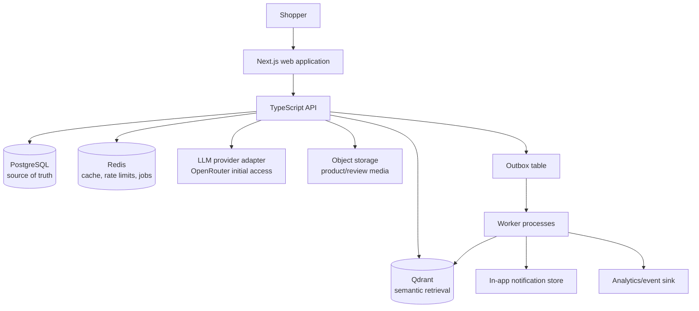
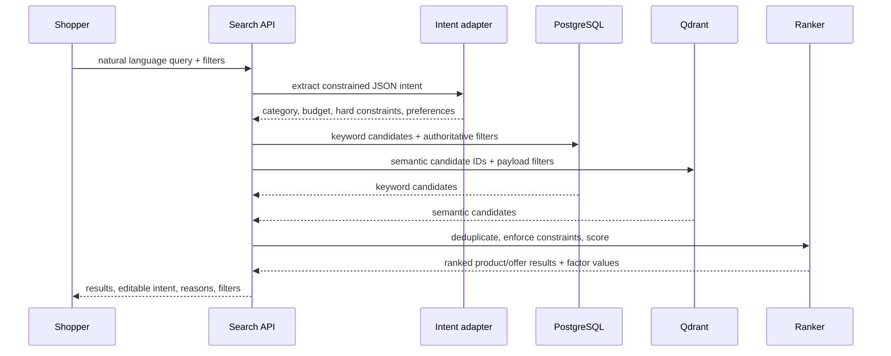

# Veyra — Technical Architecture

**Status:** Reference-approved architecture; implementation remains gated by unresolved decisions in the build plan  
**Product:** Veyra  
**Architecture style:** Modular monolith with asynchronous workers  
**Primary constraint:** Deliver Amazon.com consumer-commerce parity first, then add Veyra intelligence without pretending to operate Amazon-scale infrastructure.

## 1. Architecture decisions

| Decision | Choice | Rationale |
|---|---|---|
| Application shape | Modular monolith with pnpm workspaces and TypeScript strict mode | Keeps the system easy to ship, test, and deploy while preserving domain boundaries that can later be extracted. |
| Web client | Next.js + TypeScript | Supports responsive SSR/streaming-capable commerce pages, route-level loading states, and a typed component system. |
| API | Hono TypeScript backend deployed on Vercel | Owns authentication, domain logic, transactions, authorization, and public API contracts. It is separate from the web UI so commerce rules are not tied to React routes. |
| Data access and migrations | Drizzle ORM + committed SQL migrations | Provides typed database access while keeping schema changes reviewable, reproducible, and deployment-gated. |
| System of record | Neon PostgreSQL | Strong transactional consistency for catalog, offers, carts, orders, returns, reviews, and user data. PostgreSQL remains authoritative. |
| Vector retrieval | Qdrant Cloud | Holds non-authoritative product/review embeddings for semantic candidate retrieval. PostgreSQL remains authoritative; Qdrant indexes are rebuildable. Initial use targets Qdrant Cloud's advertised free tier, with pricing/limits rechecked before production. |
| Cache and ephemeral data | Upstash Redis | Caches, rate limits, short-lived session data, job coordination, and idempotency keys. It is never the sole record of a purchase or order. |
| AI integration | Provider adapter with OpenRouter as the initial LLM access layer | Enables structured intent extraction and grounded summaries while preserving deterministic fallbacks and future model choice. Initial candidate model: `google/gemini-2.5-flash-lite`; backup candidate: `openai/gpt-4.1-mini` or current equivalent when stricter structured-output reliability is needed. Credentials, downstream model policy, provider terms, retention posture, and timeouts remain D-11 operational enablement work; spend caps are managed in OpenRouter. |
| Async work | Database outbox + worker | Reliable event publishing without Kafka or a distributed event platform in the initial release. |
| Payments and shipping | Simulated adapters | Enables an authentic checkout/order experience without handling regulated payment data or real carrier commitments. Initial commerce uses the confirmed D-04 India/INR simulation policy for GST, PIN-aware shipping/delivery, reservation, cancellation, returns/refunds, and P0 promotion fixtures. |

## 2. High-level topology



The Next.js web app and Hono API deploy to Vercel as separate request/response surfaces. Current scope does not require WebSockets, SSE, or other long-lived backend connections; notification and order timelines can update through page loads, refresh, or polling until a future realtime ADR exists. Worker code remains in the same modular codebase, but outbox draining and other asynchronous duties must run through Vercel scheduled functions or another explicitly approved managed background-job mechanism rather than assuming a continuously running in-process server.

## 2.1 Baseline-first implementation rule

Every AI-facing module is behind a capability flag and calls an already-existing deterministic consumer flow. The release sequence is:

```text
Baseline catalog/search/product/cart/checkout/order/return APIs
  → baseline web journeys and policy rules
  → event capture and retrieval indexing
  → AI intent, explanations, summaries, and support proposals
```

Examples: search works with lexical retrieval and filters before hybrid search is enabled; product comparison works as a fact table before AI summarization; order self-service works through normal endpoints before an assistant can propose those same actions.

## 3. Domain boundaries

Each module owns its schema access, policies, commands, queries, events, and tests. Cross-module communication uses explicit interfaces or domain events—not direct table writes from arbitrary modules.

| Module | Responsibilities |
|---|---|
| Identity & account | Authentication, sessions, user profile, addresses, preferences, authorization. |
| Catalog | Products, categories, variants, specifications, media, normalized attributes. |
| Offers & inventory | Seller offers shown to consumers, price, condition, availability, warehouse allocation, stock reservations. |
| Search & discovery | Keyword retrieval, semantic retrieval, filtering, ranking, recommendations, search analytics. |
| Decision intelligence | Query-intent extraction, explanation generation, comparison summaries, review synthesis. |
| Cart & promotions | Cart lifecycle, item validation, coupons, promotion eligibility, money totals. |
| Checkout & orders | Checkout session, mock payment authorization, order creation, order state machine, invoices/confirmation. |
| Fulfillment | Warehouse selection, delivery promise calculation, shipment/tracking simulation. |
| Returns & refunds | Eligibility, return requests, replacement/refund rules and lifecycle. |
| Reviews & Q&A | Review eligibility, reviews, helpful votes, product questions/answers, moderation flags. |
| Lists & personalization | Wishlist/custom lists, browsing and purchase events, buy again, recommendation inputs. |
| Notifications | In-app messages generated from order, return, price, and stock events. |
| Support | Grounded, confirmation-based self-service actions over orders and returns. |

The domain list is intentionally limited to consumer marketplace needs. Seller dashboards, warehousing-operator tooling, ad campaign management, B2B procurement, and real payment acquiring are not initial modules.

## 4. Data model

### 4.1 Core entities

```text
User
 ├── Address
 ├── PaymentMethodToken (mock provider token only)
 ├── Preference
 ├── BrowseEvent
 ├── SearchEvent
 ├── Cart
 ├── Order
 ├── List
 └── Notification

Product
 ├── Category
 ├── ProductVariant
 ├── ProductAttribute
 ├── ProductMedia
 ├── ProductReview
 ├── ProductQuestion
 └── Offer

Offer
 ├── SellerProfile (consumer-visible identity only)
 ├── OfferPrice
 ├── InventoryItem
 └── WarehouseStock

Order
 ├── OrderItem
 ├── PaymentAttempt
 ├── Shipment
 ├── OrderStatusHistory
 └── ReturnRequest
```

### 4.2 Important relational tables

| Table | Selected fields / constraints |
|---|---|
| `products` | `id`, `slug` unique, `title`, `brand`, `category_id`, `description`, `status`. |
| `product_variants` | `id`, `product_id`, `sku` unique, `attributes jsonb`, `active`. |
| `offers` | `id`, `variant_id`, `seller_id`, `currency`, `list_price`, `sale_price`, `condition`, `active`. Prices use integer minor units or decimal money type; never floats. |
| `warehouse_stock` | `offer_id`, `warehouse_id`, `on_hand`, `reserved`, `version`; available quantity is derived as `on_hand - reserved`. |
| `carts` / `cart_items` | User/guest owner, offer/variant, quantity, selected delivery option. Validate price and availability server-side at each mutation. |
| `orders` / `order_items` | Immutable order snapshot of product title, offer, selected variant, unit price, discounts, tax, and delivery address. |
| `shipments` | `order_id`, `status`, promised delivery window, tracking timeline. |
| `return_requests` | Item-level request, reason, method, state, decision metadata, refund amount. |
| `reviews` | `product_id`, `user_id`, optional `order_item_id`, rating, body, verified flag, status. Unique constraint prevents duplicate review per user/order item. |
| `search_events` / `browse_events` | Privacy-aware event records for relevance evaluation and personalization. |
| `outbox_events` | Event payload, type, aggregate ID, created/processed timestamps, retry count. |

### 4.3 Transactional rules

- PostgreSQL is authoritative for availability, prices, carts, orders, and return state.
- Checkout locks or atomically updates inventory rows using optimistic version checks or `SELECT … FOR UPDATE` in a short transaction.
- Stock is reserved before order confirmation. Reservation release occurs on payment failure, expiry, or cancellation.
- Every order/return transition appends a status-history record.
- Commands support an idempotency key. Repeated checkout, cancellation, or return requests return the original result instead of duplicating work.
- Outbox records are inserted in the same transaction as the state change that produced them.

## 5. Search and decision-intelligence architecture

### 5.1 Search request path



### 5.2 Query understanding contract

The model returns validated JSON, never SQL or executable instructions:

```json
{
  "category": "laptops",
  "budget": { "currency": "INR", "maxMinor": 12000000 },
  "hardConstraints": [{ "attribute": "ram_gb", "operator": ">=", "value": 16 }],
  "preferences": ["battery life", "portability", "thermal performance"],
  "confidence": 0.88,
  "clarifyingQuestion": null
}
```

The API validates categories, operators, attributes, values, currencies, and price bounds against an allowlist. If validation fails or the provider is unavailable, the request falls back to lexical search with user-selected filters.

### 5.3 Hybrid retrieval and ranking

1. Use PostgreSQL full-text/trigram search for lexical candidates and authoritative hard filters.
2. Use Qdrant for dense-vector candidates built from product title, category, description, normalized attributes, and review themes.
3. Union and deduplicate candidates by product/variant ID.
4. Re-fetch current offers, stock, and prices from PostgreSQL.
5. Remove products that violate hard constraints.
6. Apply a versioned deterministic ranker.

Initial score components:

```text
score =
  0.35 × retrieval relevance
+ 0.25 × explicit preference match
+ 0.15 × rating confidence
+ 0.15 × price fit
+ 0.10 × delivery fit
```

Scores, weights, and component inputs are logged for evaluation. Explanations are rendered from the actual component values; an LLM may improve wording but cannot invent reasons.

### 5.4 Grounded AI output

| Capability | Allowed inputs | Output | Guardrail |
|---|---|---|---|
| Intent extraction | User query + known taxonomy | Validated structured intent | Schema validation and fallback. |
| “Why this?” | Rank-factor values + product attributes | Concise reason/trade-off | Template-first; no unsupported claims. |
| Product comparison | Selected product fact sheets | Similarities, differences, recommendation conditional on stated priorities | Fact sheets are the complete context; unavailable fields are stated. |
| Review summary | Moderated review snippets + aggregate counts | Themes, sentiment distribution, caveats | Cite theme counts/snippets in UI; never conceal source reviews. |
| Support | Authenticated user, allowed order/return tool results | Answer and proposed action | Read tools first; mutations require explicit confirmation. |

## 6. API design

The web app consumes versioned JSON APIs. REST-style resource endpoints are sufficient; API contracts should be generated from a shared schema package (for example, Zod/OpenAPI) so the client and server stay aligned.

### 6.1 Representative endpoints

| Area | Endpoints |
|---|---|
| Search | `GET /v1/search`, `POST /v1/search/intent`, `GET /v1/search/suggestions` |
| Catalog | `GET /v1/products/:slug`, `GET /v1/products/:id/offers`, `POST /v1/compare` |
| Cart | `GET /v1/cart`, `POST /v1/cart/items`, `PATCH /v1/cart/items/:id`, `DELETE /v1/cart/items/:id` |
| Checkout | `POST /v1/checkout/quote`, `POST /v1/checkout/confirm` |
| Orders | `GET /v1/orders`, `GET /v1/orders/:id`, `POST /v1/orders/:id/cancel` |
| Returns | `POST /v1/orders/:id/returns/eligibility`, `POST /v1/returns`, `GET /v1/returns/:id` |
| Reviews | `GET /v1/products/:id/reviews`, `POST /v1/products/:id/reviews`, `GET /v1/products/:id/review-summary` |
| Account | `GET/PATCH /v1/me`, `GET/POST/PATCH/DELETE /v1/me/addresses` |
| Support | `POST /v1/support/conversations`, `POST /v1/support/actions/confirm` |

All mutating endpoints require authentication, authorization, input validation, and an idempotency key where retries could produce duplicate state.

## 7. State machines

### 7.1 Order and shipment

```text
PLACED → CONFIRMED → PROCESSING → SHIPPED → OUT_FOR_DELIVERY → DELIVERED
                 └→ CANCELLED

SHIPPED → DELIVERY_EXCEPTION → OUT_FOR_DELIVERY | RETURNED_TO_SENDER
```

### 7.2 Return and refund

```text
REQUESTED → APPROVED → IN_TRANSIT → RECEIVED → REFUND_INITIATED → REFUNDED
     └→ REJECTED
     └→ CANCELLED
```

Transitions live in domain services, not controller conditionals. Each transition validates current state, policy, actor authorization, and required supporting data before writing the next state and outbox event.

## 8. Background jobs and events

The initial platform uses a transactional outbox and workers. This is sufficient for reliability and traceability without Kafka.

| Event | Consumers |
|---|---|
| `catalog.product_published` | Embedding/index job, discovery cache invalidation. |
| `offer.changed` | Search cache invalidation and price-watch notification evaluation when price, availability, or delivery inputs change. |
| `order.confirmed` | Fulfillment simulation, order confirmation notification, analytics. |
| `shipment.status_changed` | Tracking timeline, delivery notification, analytics. |
| `order.delivered` | Review eligibility, return-window calculation, buy-again signal. |
| `return.requested` | Return workflow, support timeline, analytics. |
| `return.refunded` | Refund notification and order timeline update. |
| `review.published` | Review-summary refresh and product index refresh. |

Workers use bounded retries, exponential backoff, dead-letter visibility, structured logs, and idempotent consumers.

## 8.1 Simulation adapter contract

Payment and shipping adapters are mock integrations, but they still expose explicit contracts rather than ad hoc test shortcuts. The U3 contract must document success, decline/failure, timeout, retry, idempotency, shipment-progress, cancellation, and refund-simulation states; shopper copy must disclose simulated payment and fulfillment behavior. No implementation may store real card data or imply a real carrier/payment commitment.

## 9. Caching, consistency, and performance

| Data | Strategy |
|---|---|
| Product detail and media metadata | Cache-aside with short TTL; invalidate on product/offer updates. |
| Search result pages | Cache normalized query/filter/sort keys briefly; never cache user-specific rank changes under shared keys. |
| Cart | PostgreSQL is canonical; Redis may cache only a short-lived read representation. |
| Inventory and checkout | Do not rely on cache for writes or final availability decisions. |
| AI results | Cache validated intent parse keyed by normalized query/taxonomy version; invalidate when parser/schema changes. |

Initial performance targets:

- Product detail p95 API latency: under 400 ms excluding media transfer.
- Cached conventional search p95: under 600 ms.
- Hybrid search p95: under 1.5 s; stream/skeleton UI while intent retrieval runs.
- Cart mutations p95: under 400 ms.
- Checkout confirmation p95: under 2 s in the simulated environment.

## 10. Security and privacy

- Use Better Auth as the authentication foundation with credentials, Google OAuth, and database-backed opaque sessions. Session expiry is 7 days with 1-day rolling refresh. Cookies are HTTP-only, secure, and SameSite=Lax. Verification and password-reset tokens are single-use and expire after 15 minutes. Do not expose credentials to browser JavaScript.
- Apply role/ownership authorization to every account, cart, order, address, review, and return resource.
- Never store real card numbers, CVVs, or bank credentials. The payment module persists opaque mock tokens only.
- Keep provider configuration environment-driven. Validate required production environment variables at startup; never invent deployed credentials, regions, domains, or unsafe production defaults. Encrypt secrets in the deployment environment; rotate provider credentials.
- Validate and size-limit all user input and media uploads; use signed object-storage upload URLs.
- Rate limit authentication, search suggestions, support, review creation, and AI endpoints.
- Treat model output as untrusted. Validate structured output, escape rendered text, and prohibit model-generated policy or price decisions.
- Minimize behavior-event data, retain it for defined periods, and provide user controls for personalization/history where implemented.
- Write audit records for state-changing support, order, return, and refund actions.

## 11. Observability and quality

### Telemetry

- Structured request logs with request ID, user/session pseudonymous ID, route, status, and latency.
- Distributed trace IDs propagated from web request through API, outbox, and worker.
- Metrics for API latency/error rate, cache hit rate, queue depth/failures, checkout reservation failures, search no-result rate, AI fallback rate, and state-transition failures.
- A redacted audit log for order, refund, return, and support mutations.

### Testing strategy

| Layer | Focus |
|---|---|
| Unit | Pricing, promotions, ranking, delivery promise, eligibility rules, state transitions. |
| Integration | PostgreSQL transactions, reservation concurrency, outbox publishing, Qdrant indexing/retrieval, provider adapters. |
| Contract | API schemas and client compatibility. |
| End-to-end | Search → product → cart → checkout → tracking; delivered order → review; delivered order → return → refund. |
| AI evaluation | Fixed intent queries, valid-schema rate, constraint accuracy, unsupported-claim rate, fallback behavior. |
| Accessibility | Keyboard flows, semantic controls, contrast, focus, form errors, responsive layout. |

## 12. Deployment

```text
Vercel CDN / edge
  → Next.js web deployment
  → Hono API deployment on Vercel request/response functions
  → scheduled or managed outbox/background execution

Neon PostgreSQL
Upstash Redis
Qdrant Cloud
Object storage + CDN
Secrets manager / environment configuration
```

Use pnpm workspaces for the TypeScript monorepo, TypeScript strict mode, Drizzle ORM, and committed SQL migrations. U0/local implementation is not blocked on final deployment topology, API keys, regions, Vercel runtime limits, cron cadence, production origins, or Google OAuth production callback configuration. Those are pre-staging/production deployment gates. Use separate staging and production environments, migration gates before API deployment, health/readiness checks, database backups, and a rollback plan. Seed data is environment-specific and clearly marked as simulated. Production email provider, verified sender domain, deliverability configuration, Vercel function runtime limits, cron cadence, region selection, and operational ownership must be documented before production launch.

## 13. Suggested repository layout

```text
apps/
  web/                 # Next.js shopper experience
  api/                 # TypeScript API
  worker/              # outbox consumers and scheduled jobs
packages/
  contracts/           # Zod/OpenAPI schemas and typed client generation
  domain/              # domain types, policies, state machines
  ui/                  # shared design system
  config/              # lint, TypeScript, environment validation
infra/
  docker/
  migrations/
  deployment/
docs/
  PRD.md
  technical-architecture.md
```

## 14. Evolution path

Do not create microservices pre-emptively. Extract a module only when it has independent scale, deployment, ownership, reliability, or security needs. Likely later candidates are search/indexing, notifications, and AI inference. Until then, retain module boundaries inside the monolith, publish explicit events, and measure the actual bottleneck.

This architecture makes Veyra credible as an intelligent marketplace while keeping the initial build simple enough to complete, operate, and explain.
